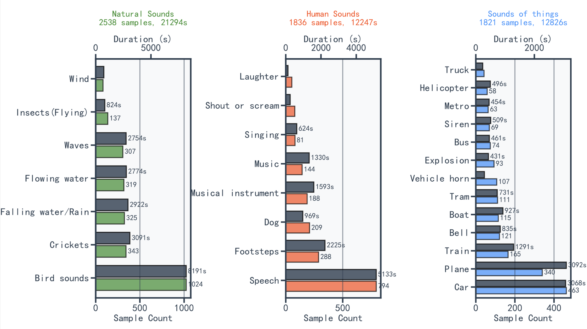
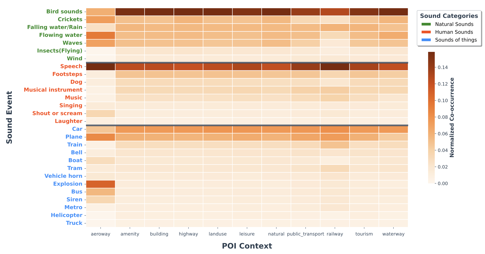
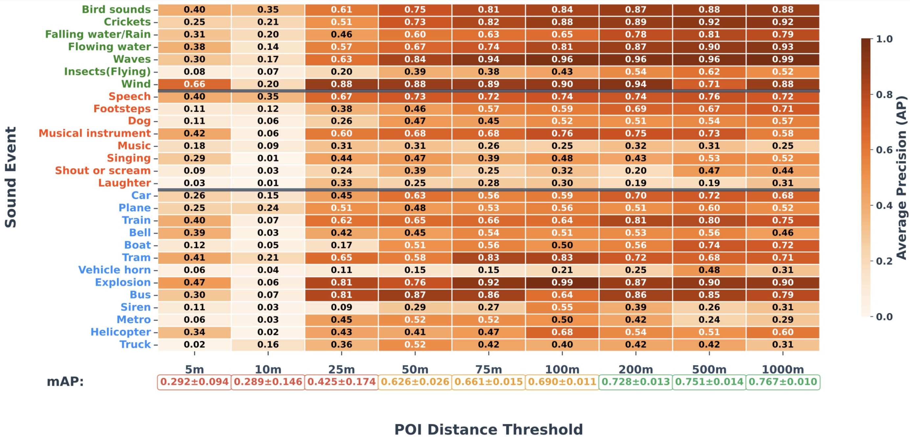
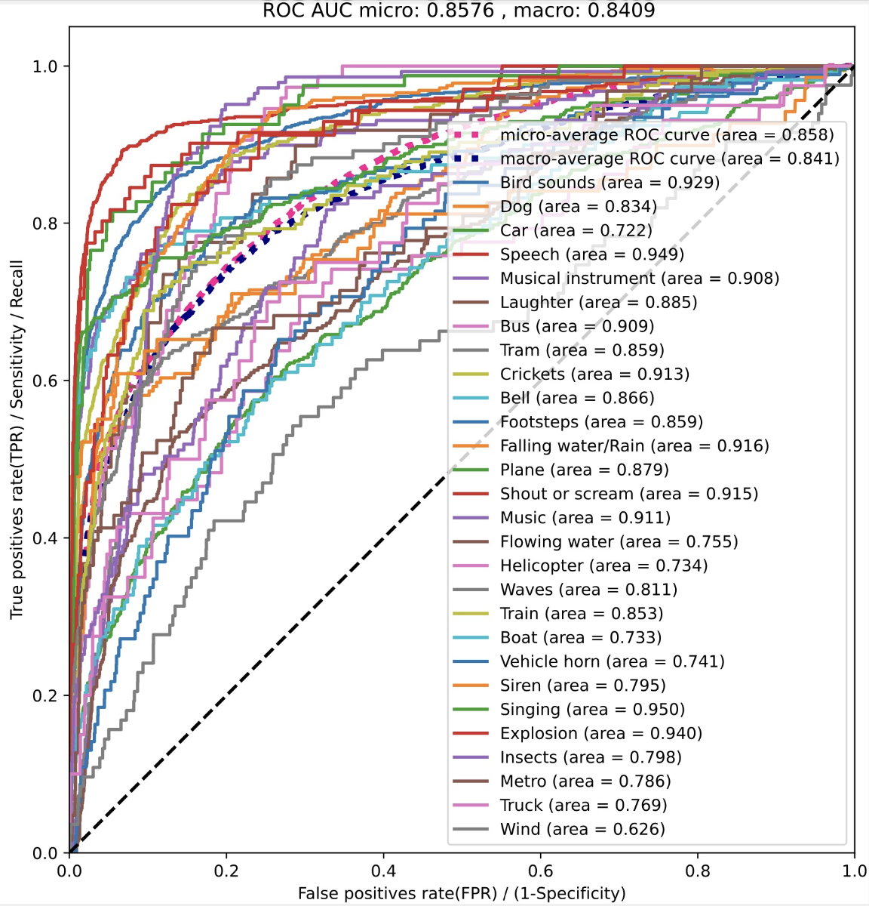
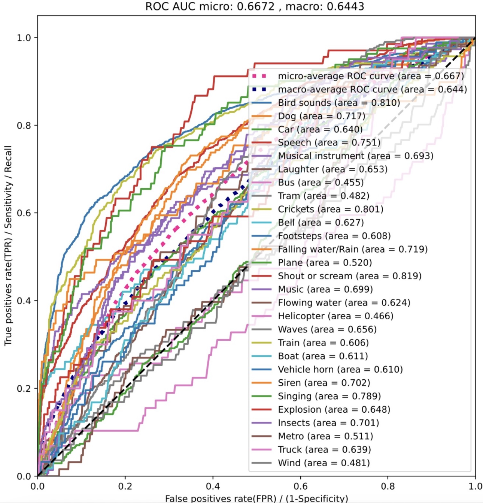
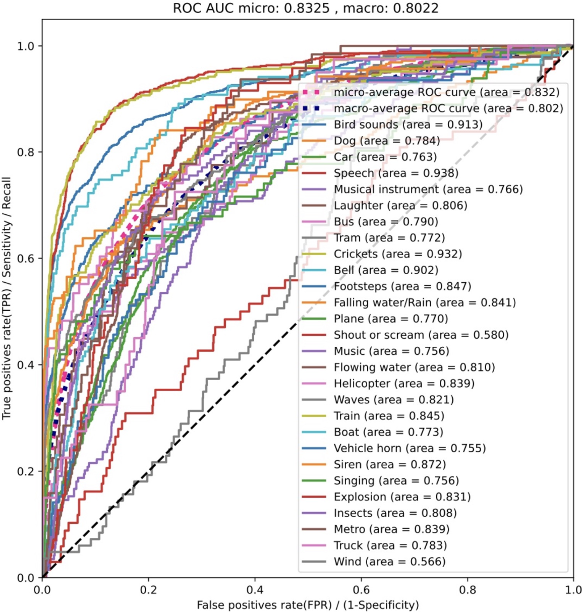
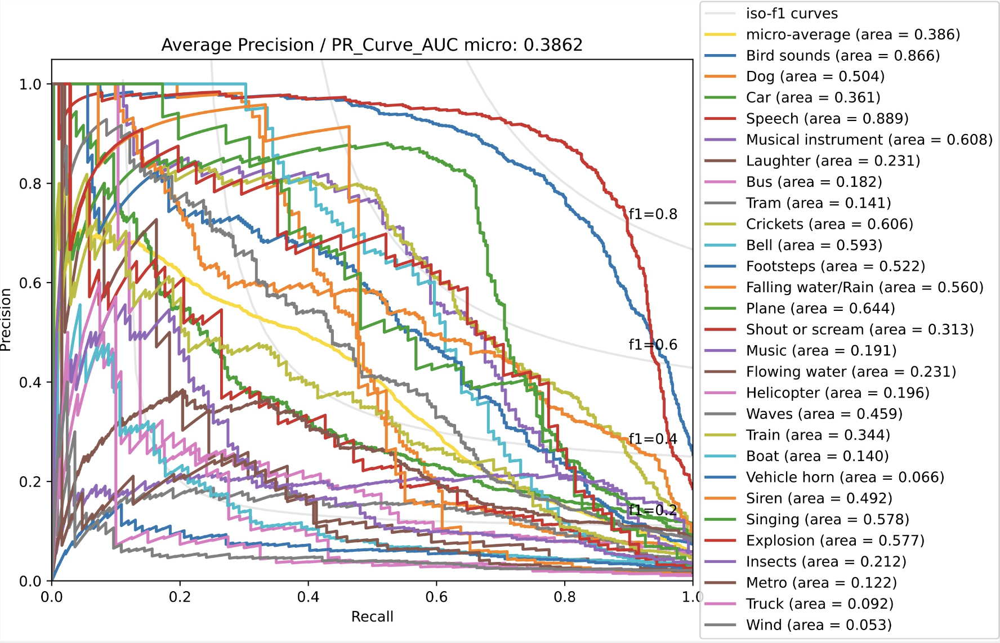
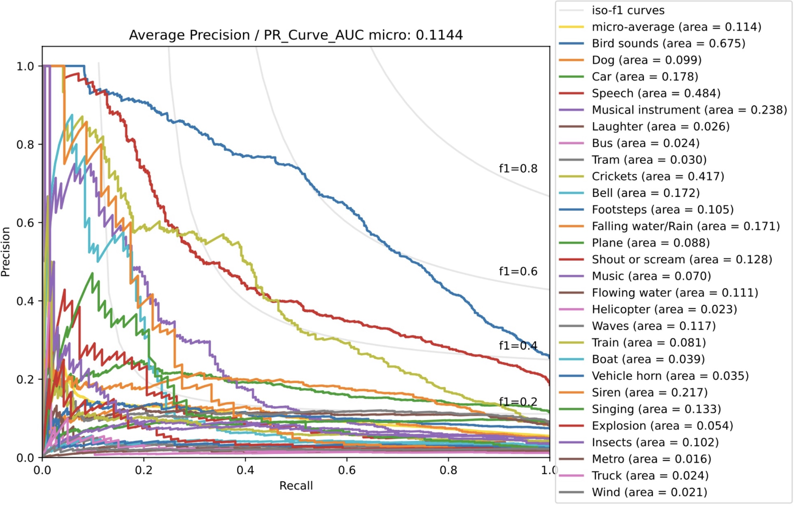
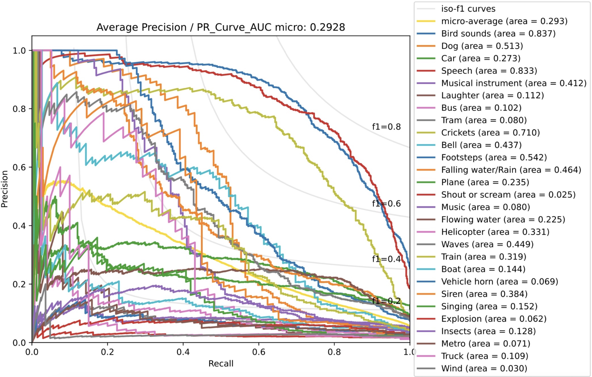

# GeoSound

**Note**: This repository is a demo showcasing the analysis results. The full dataset will be updated here once the paper is accepted.

GeoSound is a dataset designed to enhance audio tagging performance by introducing contextual information through Point-of-Interest (POI) labels. It provides a unique connection between audio events and their geographical context, offering a novel approach to address the limitations of existing audio-only datasets.

---

## Dataset Overview

- **Total Audio Clips**: 3,854
- **Total Duration**: 10 hours, 42 minutes, and 20 seconds
- **Audio Format**: 10-second, single-channel (mono) WAV files with 48 kHz sample rate and 16-bit depth.
- **Labels**:
  - **28 fine-grained event classes**
  - **11 semantic POI context classes**
  - **Multi-label classification** (multiple events can occur in a single recording)

---

## Data Collection

The audio recordings for GeoSound were sourced from **Freesound.org**, a public repository of user-contributed sounds, and from the dataset presented in Filipan et al. (2014). The recordings include GPS metadata, specifically latitude and longitude coordinates, which were used to link each sound clip to its geographic context. A careful manual review was performed to ensure the accuracy of the location data.

---

## Event and Context Annotation

- **Semantic Context Labeling**: For each audio clip with GPS coordinates, the corresponding location was queried using the OpenStreetMap (OSM) database. Points of Interest (POIs) within a defined square around the location were identified based on 11 OSM feature keys, covering categories such as land use, amenities, and natural features.
  
- **Sound Event Labeling**: Sound event labels were derived from user-provided tags on Freesound. These tags were curated into a controlled vocabulary, resulting in 28 fine-grained event classes. These 28 classes were grouped into three coarse categories:
  1. **Natural Sounds**: Environmental phenomena (e.g., wind, rain, water)
  2. **Human Sounds**: Sounds produced by humans (e.g., speech, footsteps, music)
  3. **Sounds of Things**: Mechanical, electronic, and man-made sounds (e.g., cars, sirens, explosions)

---

## Dataset Organization and Statistics

- **Audio Clips**: 3,854 clips
- **Total Duration**: 10 hours, 42 minutes, and 20 seconds
- **Label Types**: 
  - 28 fine-grained event labels
  - 11 semantic POI context labels

Each clip is a 10-second mono WAV file at 48 kHz sample rate and 16-bit depth. Each audio clip has associated sound event labels and a single POI context label.

---

## Dataset Categories

### Coarse Categories and Fine Categories

| Coarse Category       | Fine Categories                                     |
|-----------------------|------------------------------------------------------|
| **1. Natural Sounds** | Bird sounds, Crickets, Falling water/Rain, Flowing water, Waves, Insects (Flying), Wind |
| **2. Human Sounds**   | Speech, Footsteps, Dog, Musical instrument, Music, Singing, Shout or scream, Laughter |
| **3. Sounds of Things** | Car, Plane, Train, Bell, Boat, Tram, Vehicle horn, Explosion, Bus, Siren, Metro, Helicopter, Truck |

---

## Dataset Scale

The dataset contains **3,854 audio clips**, totaling **10 hours, 42 minutes, and 20 seconds** of audio. It covers a diverse range of sound events and geographical contexts.

*Figure 1. Distribution of dataset size across categories.*

*Figure 2. The co-occurrence distribution of sound events across different POI contexts.*

---

## Baseline Analysis

### 1. POI-Only Classification

The performance of the POI-Only classification is shown below:

*Figure 3. POI-Only Classification Results.*

---

### 2. Zero-Shot Audio Classification

Below are the results of the zero-shot audio classification, with 3 models evaluated on the dataset. The results are divided into two rows for clarity:

#### The ROC and P-R Curves of PANNs, AST, and CLAP:

  
  
  

  
  
  

---

### 3. Fine-Tuned Classification Results

The fine-tuned classification results (`mAP`) across 28 fine-grained categories and 3 coarse categories are presented in the table below:

| Model   | Audio-Only | Multimodal |
|---------|-----------------|---------------|
| **PANNs**| 0.770      | 0.824      |
| **AST**  | 0.820      | 0.829      |
| **CLAP** | 0.824      | 0.842      |

*Table 1. 28 fine-grained categories Fine-Tuned Classification Results on GeoSound Dataset.*

| Model   | Audio-Only | Multimodal |
|---------|-----------------|---------------|
| **PANNs**| 0.961      | 0.964      |
| **AST**  | 0.904      | 0.912      |
| **CLAP** | 0.966      | 0.968      |

*Table 2. 3 coarse categories Fine-Tuned Classification Results on GeoSound Dataset.*

---

